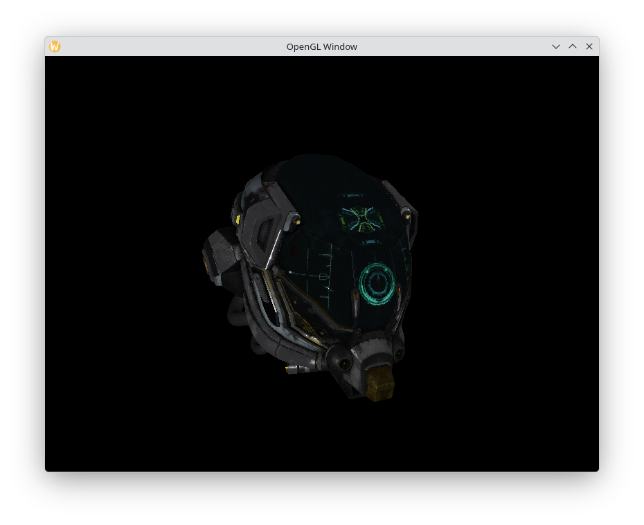
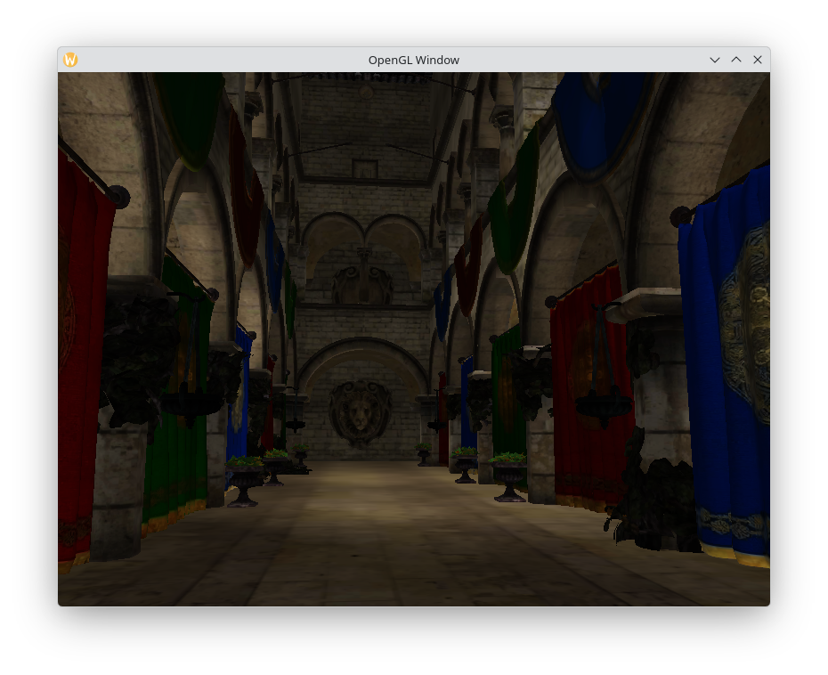

# NoRo. Framework
>[!CAUTION]
>This is still **Work-in-Progress**. DO **NOT** USE IT FOR PRODUCTIONS

## Dependencies

Download KTX2 dev-tools from Khronos's Github Repository:
https://github.com/KhronosGroup/KTX-Software/releases

>[!TIP]
>Sometimes Khronos don't build their library for every system. For this situation, consider skimming versions in order to find comparable one

**For Fedora:**

    sudo dnf install glfw-devel glew-devel

**For Debian-based:**

    sudo apt update && sudo apt install libglfw3-dev libglew-dev

**For Arch-based:**

    sudo pacman -S glfw glew

## Usage
This framework is headers only based.
Just copy `NoRo/` and `#include "NoRo/init.h"`

Also, target libraries `-lGL -lglfw -lm -lGLEW -lktx`

## Third-Party Licenses
**Thanks** to everyone who made/maintaining these repositories!

`cglm` by [recp](https://github.com/recp) (https://github.com/recp/cglm) "MIT LICENSE"

`cgltf` by [jkuhlmann](https://github.com/jkuhlmann) (https://github.com/jkuhlmann/cgltf) "MIT LICENSE"

