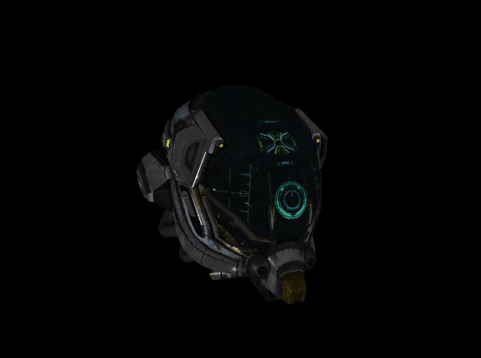
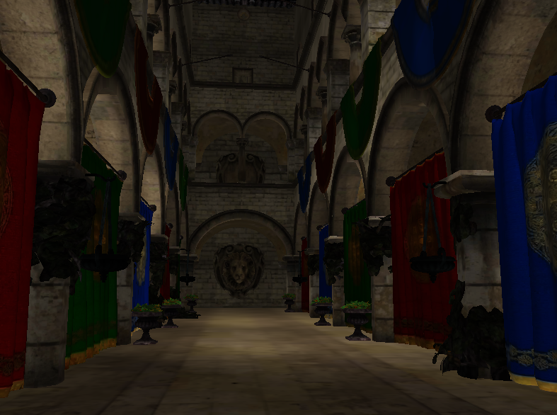

# NoRo. Framework
NoRo (Row Notation) Is a Lightweight, High-Performance 3D Renderer Written in C with memory safety. Built on top if GLTF.

## Core Features

* **Memory-Safe C Architecture:** Data-oriented design utilizing manual memory budgeting and safe arena patterns to manage entity and mesh lifecycles.
* **Modern Texture Streaming:** Integrated `libktx` pipeline to load KTX2 supercompressed textures (Basis Universal/UASTC) directly into GPU VRAM, minimizing runtime transcoding overhead.
* **glTF 2.0 Asset Compliance:** Full PBR material mapping, skeletal hierarchy tracking, and mesh rendering leveraging `cgltf` and `cglm` math utilities.

## Dependencies

Download KTX2 dev-tools from Khronos's Github Repository:
https://github.com/KhronosGroup/KTX-Software/releases

**For Fedora:**

    sudo dnf install glfw-devel glew-devel

**For Debian-based:**

    sudo apt update && sudo apt install libglfw3-dev libglew-dev

**For Arch-based:**

    sudo pacman -S glfw glew

## Usage
This framework is headers only based.
Just copy `NoRo/` and `#include "NoRo/init.h"`

Also, target libraries `-lGL -lglfw -lm -lGLEW -lktx`

## Third-Party Licenses
**Thanks** to everyone who made/maintaining these repositories!

`cglm` by [recp](https://github.com/recp) (https://github.com/recp/cglm) "MIT LICENSE"

`cgltf` by [jkuhlmann](https://github.com/jkuhlmann) (https://github.com/jkuhlmann/cgltf) "MIT LICENSE"

